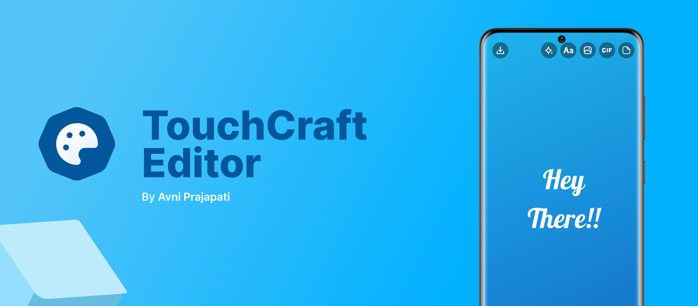
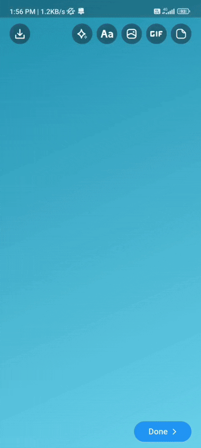
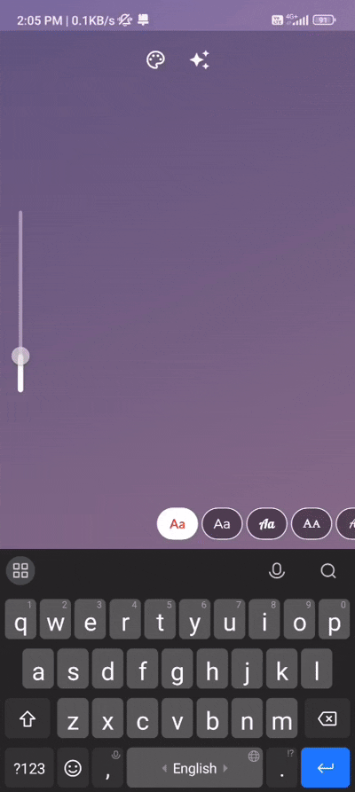
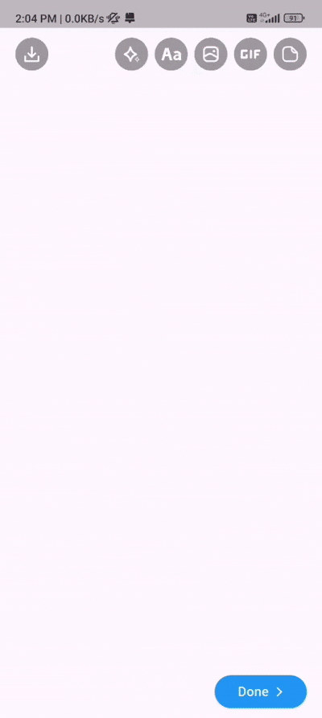

# **🎨 TouchCraft Editor ✨**



Build beautiful visual editors with Flutter! Create stunning designs with text, GIFs, stickers, gradients, and images. Customize everything, export anywhere, and re-edit anytime.


## **✨ Core Features**

| **🖼️ Image Editing**| **📝 Text Editing** | **🎭 GIF Support** |
|:----------------|:----------------|:----------------|
| Add, crop, scale, and rotate images with intuitive controls | Customize background colors, text colors, font sizes, and styles | Seamlessly add animated GIFs via GIPHY integration |
|  |  |  |

| **🎪 Sticker Features**| **🎨 Background Customization** | **🖌️ Create design** |
|:----------------|:----------------|:----------------|
|Create custom stickers from your gallery images|Apply solid colors or beautiful gradient backgrounds| That's it GO Creative! |
|||  |

### **🔄 Re-Editable Designs**
Load and modify existing designs with full fidelity preservation

### **📚 Layer-Based Design**
Professional-grade layer system - move, stack, rotate, and scale elements like in design tools

## **🚀 Quick Start**

Get started with TouchCraft Editor in just a few lines of code:

```dart
class EditorScreen extends StatelessWidget {
  const EditorScreen({super.key});

  @override
  Widget build(BuildContext context) {
    return TouchCraftEditor(
      onDesignReady: (designFile, backgroundGradientColorList, canvasElementList) {
        // Handle your exported design here
      },
    );
  }
}
```

## **⚠️ Important Setup**

### **Android Configuration**
To avoid build-time warnings, follow these steps:

1. Create `proguard-rules.pro` file at `your_application/android/app/proguard-rules.pro`
2. Add the following line:
```
-dontwarn org.tensorflow.lite.gpu.GpuDelegateFactory$Options
```

### **ML Model for Sticker Creation**
If you're using the create sticker feature:

1. Download the ML model from [this link](https://github.com/dailystudio/ml/blob/master/deeplab/app/src/main/assets/deeplabv3_257_mv_gpu.tflite)
2. Create directory: `assets/models/` in your Flutter project
3. Place the downloaded `deeplabv3_257_mv_gpu.tflite` file in this directory

### **Giphy Api key for GIF ediitor**
if you using GIF editor you have to provide Giphy Api key like this,

```dart
TouchCraftEditor(
  giphyApiKey: "GIPHY_API_KEY",
)
```
Note : To generate api key head over to this [guide](https://developers.giphy.com/).

## **🛠️ Customization & Flexibility**

### **🎛️ Toggle Features**
Choose exactly which editing tools to expose:
- Image editing
- GIF integration  
- Sticker creation
- Text editing
- Gradient backgrounds

### **🎨 Theming Support**
- Quick setup with primary color configuration
- Fully customizable UI to match your app's design
- Complete control over icons, buttons, and widgets

### **📱 Cross-Platform**
100% compatible with both Android & iOS

### **💾 Export Options**
Save your creations as PNG, JPG, or animated GIF

## **📖 Detailed Usage**

### **Basic Implementation**

```dart
class EditorScreen extends StatelessWidget {
  const EditorScreen({super.key});

  @override
  Widget build(BuildContext context) {
    return TouchCraftEditor(
      onDesignReady: (designFile, backgroundGradientColorList, canvasElementList) {
        // Handle the exported design
      },
    );
  }
}
```

### **Understanding onDesignReady Callback**

The `onDesignReady` callback returns three important parameters:

1. **`designFile`** - The final exported image (PNG/JPG) or animated GIF
2. **`backgroundGradientColorList`** - Background gradient colors if applied
3. **`canvasElementList`** - Complete list of all CanvasElement models used

```dart
onDesignReady: (designFile, backgroundGradientColorList, canvasElementList) {
  // Save designFile to gallery or cloud storage
  // Store canvasElementList as JSON for re-editing capability
},
```

> **💡 Pro Tip**: Store `canvasElementList` as JSON to enable re-editing functionality!

### **Feature Configuration**

Control which editing features are available (all are `true` by default):

```dart
TouchCraftEditor(
  enableBackgroundGradientEditor: true,
  enableGifEditor: true,
  enableImageEditor: false,
  enableStickerEditor: true,
  enableTextEditor: false,
  onDesignReady: (designFile, backgroundGradientColorList, canvasElementList) {},
)
```

### **Export Format Configuration**

Choose your preferred export format:

```dart
TouchCraftEditor(
  imageFormatType: ImageFormatType.jpg, // or ImageFormatType.png
  // ... other parameters
)
```

### **Animation Duration**

Customize transition animations:

```dart
TouchCraftEditor(
  animationsDuration: Duration(milliseconds: 500),
  // ... other parameters
)
```

### **Color & Font Customization**

Provide custom color palettes and font families:

```dart
TouchCraftEditor(
  backgroundGradientColorList: [
    [Color(0xFF2193b0), Color(0xFF6dd5ed)],
    [Color(0xFFb92b27), Color(0xFF1565C0)],
    [Color(0xFF373B44), Color(0xFF4286f4)],
  ],
  fontFamilyList: ['Lato', 'Montserrat', 'Lobster'],
  fontColorList: [Colors.black, Colors.white, Colors.red],
  // ... other parameters
)
```

### **Theme Integration**

Match your app's primary color:

```dart
TouchCraftEditor(
  primaryColor: Colors.green,
  // ... other parameters
)
```

## **🎯 Advanced Customization**

### **Custom UI Components**

Take full control over the editor's appearance by providing custom widgets:

#### **Custom Done Button**
```dart
TouchCraftEditor(
  onDesignReady: (designFile, backgroundGradientColorList, canvasElementList) {
    // Handle exported design
  },
  doneButtonChild: Container(
    padding: EdgeInsets.symmetric(horizontal: 24, vertical: 12),
    decoration: BoxDecoration(
      gradient: LinearGradient(colors: [Colors.blue, Colors.purple]),
      borderRadius: BorderRadius.circular(25),
    ),
    child: Text(
      "✨ Finish Design",
      style: TextStyle(color: Colors.white, fontWeight: FontWeight.bold),
    ),
  ),
)
```

#### **Custom No Internet Widget**
```dart
TouchCraftEditor(
  onDesignReady: (designFile, backgroundGradientColorList, canvasElementList) {},
  internetConnectionWidget: Container(
    padding: EdgeInsets.all(32),
    child: Column(
      mainAxisSize: MainAxisSize.min,
      children: [
        Icon(Icons.wifi_off, size: 64, color: Colors.grey),
        SizedBox(height: 16),
        Text(
          "🌐 No Internet Connection",
          style: TextStyle(fontSize: 18, fontWeight: FontWeight.bold),
        ),
        SizedBox(height: 8),
        Text(
          "Please check your connection and try again",
          textAlign: TextAlign.center,
          style: TextStyle(color: Colors.grey[600]),
        ),
      ],
    ),
  ),
)
```

## **🤝 Contributing**

We welcome contributions! Help make TouchCraft Editor even better.

### **How to Contribute**

1. **Fork** the repository
2. **Create an issue** describing your proposed changes
3. **Create a feature branch** (`git checkout -b feature/amazing-feature`)
4. **Commit your changes** (`git commit -m 'Add amazing feature'`)
5. **Push to the branch** (`git push origin feature/amazing-feature`)
6. **Submit a pull request**

### **Contribution Guidelines**

- Ensure your code follows the existing style
- Add tests for new features
- Update documentation as needed
- Be descriptive in your commit messages

## **📄 License**

This project is licensed under the MIT License - see the LICENSE file for details.

## **🆘 Support**

Found a bug or need help? 

- **Issues**: [Create an issue](https://github.com/7span/touch-craft-editor/issues)

## **👥 Maintainers**

- [Avni Prajapati](https://github.com/avni-7span)
---

**Made with ❤️ for the Flutter community**